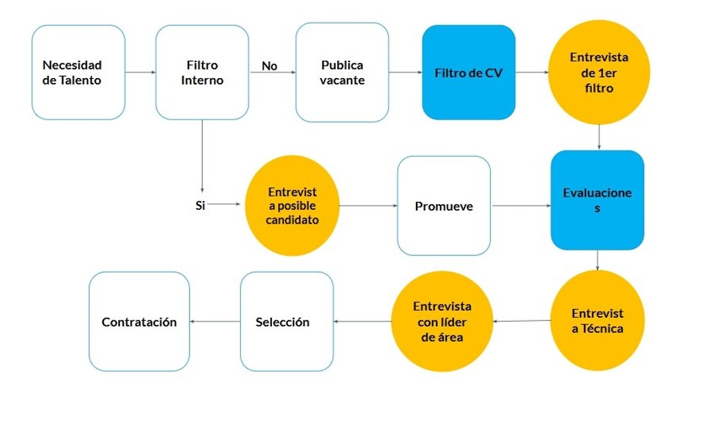

# Interview course

##### Table of contents
* [Introduction](#introduction) 
* [Illustrations](#illustrations)
*******************************************************
## Introduction
In this course we learned the importance of the interview components, and the better ways to answer all the questions. In addition, the selection process can be defined as the process of selection and shortlisting of the right candidates with the necessary qualifications and skill set to fill the vacancies in an organization.
*******************************************************

## Illustrations
###### Selection process

